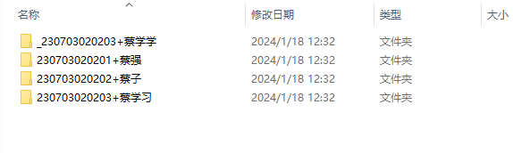

# 统计分数

注意：可能 id 会变动，文件夹名称不一样，注意修改！

## 编辑距离

将文本文件保存到 `班级` 目录下，格式为数字id+姓名.txt，如:

```
202401020202+李华.txt
202401020203+李明.txt
```

```bash
python GetPrintCount.py
```

其中比较文本为 `Standard.txt`,会计算该文本与班级文本的编辑距离，最终返回一个电子表格。

## 检测分数

需要将文件夹放到 `班级` 目录下，将关键部分以 `_` 分隔开，或者不要 `_` 前面部分都可以，注意手动切换到每个部分下！



```bash
python DetectPerStudent.py
```

## 合并

注意文件夹位置，可以自己手动修改！

```bash
python testMerge.py
```

将五个电子表格合并为1个电子表格，并且返回！